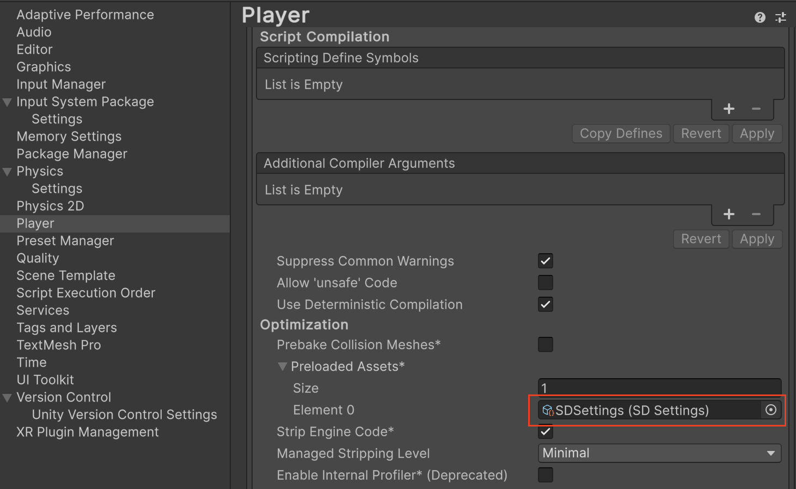
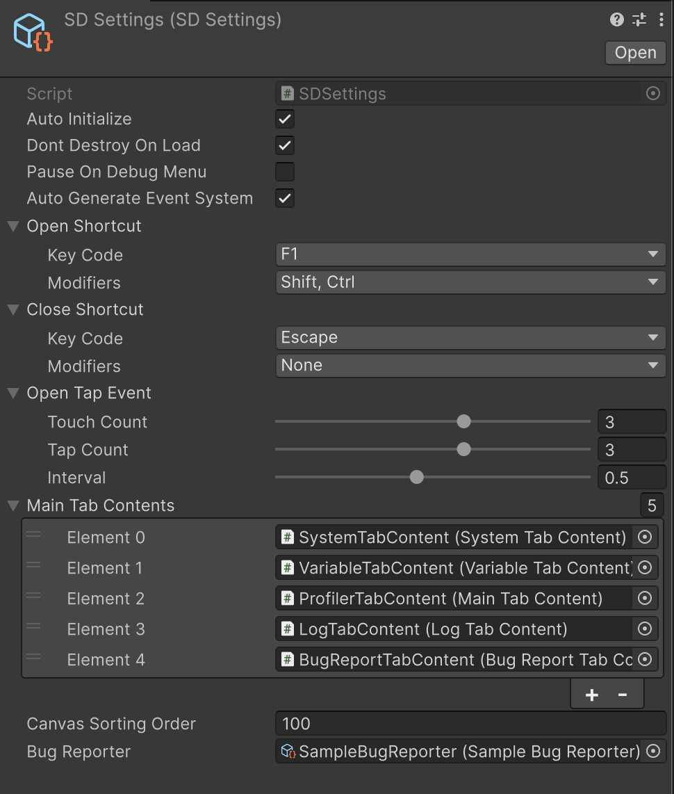
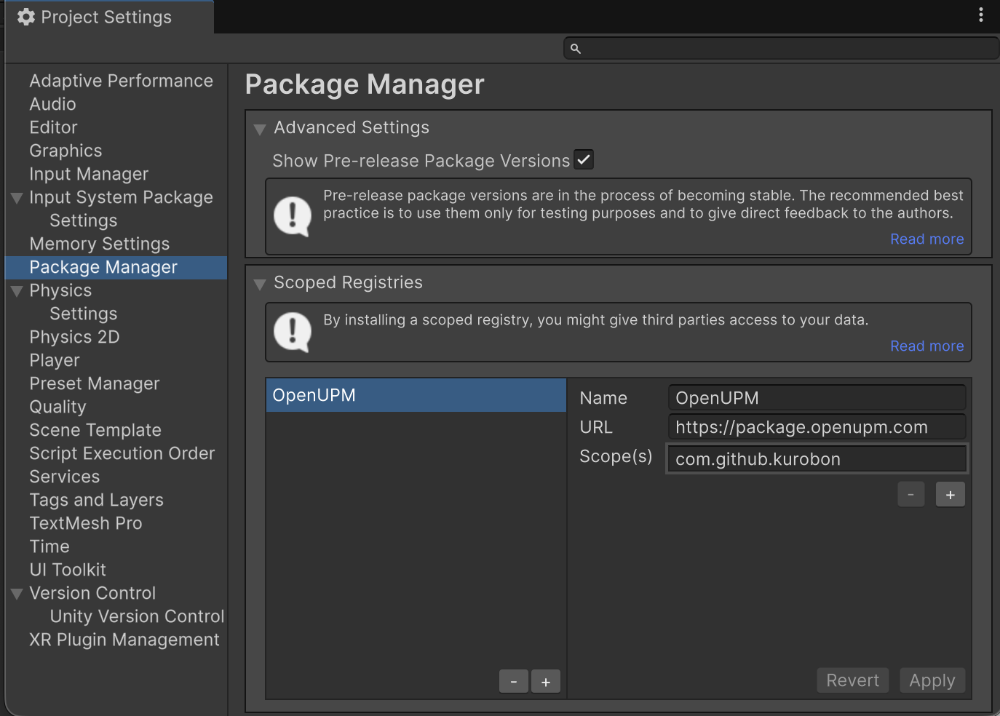
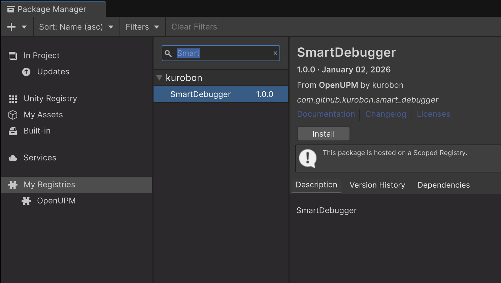

# SmartDebugger

SmartDebugger is a **lightweight, extensible in-game debugging tool for Unity**, primarily designed for mobile platforms.

It allows you to inspect system information, tweak debug values, view logs, monitor basic performance, and collect bug reports **directly on real devices after build**.

---

## Features

- System Information viewer
- Runtime debug value editing
- In-game log viewer (Unity logs)
- Lightweight profiler
- Bug report collection

---

## 1. SystemInfo

Displays detailed runtime and device information.

Example information:

- Unity version
- Platform / OS version
- Device model
- CPU / GPU
- Total system memory
- Screen resolution / DPI
- Graphics API

This is especially useful for collecting device-specific information during testing.


---

## 2. Debug Variables (Runtime Parameters)

You can register debug parameters and **modify them at runtime without changing code**.

Supported types:

| Type | Variable | Field |
|------|-------------|----|
| bool | BoolVariable | `(Checkbox)`
| int | IntVariable | `(InputField, Slider)`
| float | FloatVariable | `(InputField, Slider)`
| string | TextVariable | `(InputField)`
| enum | EnumVariable | `(Dropdown)`
| List | SelectionVariable | `(Dropdown)`

All values are reflected immediately when changed from the UI.


### Code Example: Registering Debug Values

```csharp
using SmartDebugger;
using UnityEngine;

/// <summary>
/// Sample component that registers a custom field layout to SmartDebug.
/// </summary>
public class Example : MonoBehaviour, IFieldLayout
{
    /// <summary>
    /// Title displayed in the Variable Tab.
    /// </summary>
    public string Title => "Example";

    /// <summary>
    /// Integer variable exposed to the debug UI.
    /// </summary>
    private readonly IntVariable _int = new("Int", defaultValue: 50, maxValue: 100, serializeKey: "sd.int");

    private void Start()
    {
        // Register this layout so that SmartDebug can invoke OnLayout
        SmartDebug.Instance.AddFieldLayout(this);
    }

    /// <summary>
    /// Defines the field layout.
    /// </summary>
    /// <param name="groups">Container used to organize debug fields.</param>
    public void OnLayout(FieldGroups groups)
    {
        // Create a group labeled "Int"
        groups.AddGroup("Int", group =>
        {
            // Add a numeric input field
            group.AddField(_int);

            // Add a slider bound to the same value
            group.AddSlider(_int, width: 300f);
        });
    }
}

```

---

## 3. Log Viewer

Displays Unity logs (`Debug.Log`, `Debug.LogWarning`, `Debug.LogError`) **in real time** inside the game.

Features:

- Log level filtering (Log / Warning / Error)
- Text filtering
- Auto-scroll
- Available in build (no Editor connection required)

This is extremely useful when debugging issues on devices.


---

## 4. Profiler

Provides lightweight runtime performance monitoring.

Displayed metrics:

- FPS (frame rate)
- Memory usage

Use cases:

- Detecting sudden performance drops
- Comparing device performance

This is intended for **quick inspection**, not deep profiling.


---

## 5. Bug Report

Allows testers or developers to **collect bug reports directly from the device**.

Collected data may include:

- User-entered description
- SystemInfo
- Runtime logs
- Screenshot

Ideal for QA and playtesting builds.


---

## Settings (SDSettings)

SmartDebugger behavior is configured via the **`SDSettings` ScriptableObject**.

Create it from the Unity menu:

```
Create → SmartDebugger → SD Settings
```

SDSettings must be registered in the preloaded assets.


### General Settings



| Setting | Description |
|-------|-------------|
| **Auto Initialize** | Automatically initializes SmartDebugger at runtime |
| **Dont Destroy On Load** | Keeps the debugger across scene loads |
| **Pause On Debug Menu** | Pauses the game while the debug menu is open |
| **Auto Generate EventSystem** | Automatically creates an `EventSystem` if none exists |

### Open / Close Triggers

SmartDebugger supports both **keyboard shortcuts** and **touch gestures**.

#### Keyboard Shortcuts

- **Open Shortcut**
  - Default: `Ctrl + Shift + F1`
- **Close Shortcut**
  - Default: `Escape`

These shortcuts work with:
- Legacy Input
- Input System (if installed)

#### Touch Gesture (Mobile)

Designed primarily for **Android / iOS** builds.

Default gesture:

- **3-finger triple tap**
- Max interval between taps: `0.5s`

This allows opening the debug menu on devices without hardware keyboards.

> ⚠️ **URP / HDRP Runtime Debug UI Conflict**
>
> In URP / HDRP, the default **3-finger double tap** gesture may conflict with the built-in SRP Runtime Debug UI.
>
> If SmartDebugger does not open as expected, disable the SRP runtime UI by setting:
>
> ```csharp
> UnityEngine.Rendering.DebugManager.instance.enableRuntimeUI = false;
> ```
>
> This should typically be done during application initialization (e.g. at startup).

### UI Configuration

| Setting | Description |
|------|-------------|
| **Main Tab Contents** | List of tabs shown in the debug menu |
| **Canvas Sorting Order** | Sorting order of the SmartDebugger UI canvas |

---

## Installation (OpenUPM)

1. Open the package manager settings by selecting the Unity menu option Edit > Project Settings > Package Manager.
2. Add OpenUPM as a scoped registry to the Package Manager window:
```
Name: OpenUPM
URL: https://package.openupm.com
Scopes: com.github.kurobon
```
3. Open the package manager menu by selecting the Unity menu option Window > Package Manager.
4. Set the manager scope drop-down to select My Registries.
5. Select the SmartDebugger from the package list and press Install.

 

---

## Build Configuration

SmartDebugger can be completely disabled by defining the following scripting symbol:

```
DISABLE_SMART_DEBUG
```

When this symbol is defined:
- All SmartDebugger runtime logic is excluded
- No UI is created
- No event detectors are registered

This is useful for **production / release builds** where SmartDebugger should not be active.

You can define this symbol via:

- **Player Settings → Scripting Define Symbols**, or
- Build scripts / CI configuration

---
